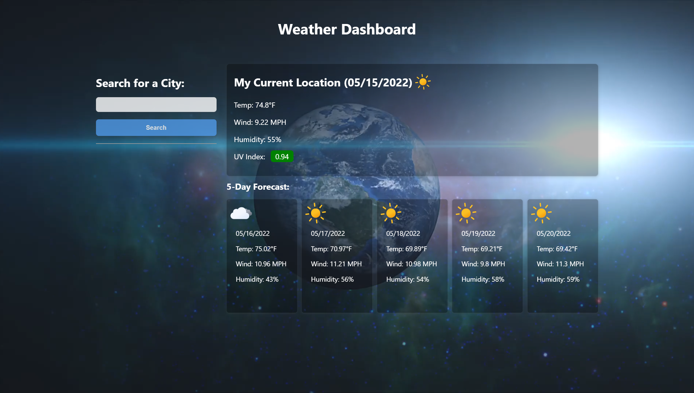

# 05-Third-Party-APIs-Work-Day-Scheduler

# Description
A Weather Dashboard that displays weather conditions. The weather conditions specify the temperature, the humidity, the wind speed, and the UV index. The UV index is color coded to indicate whether the conditions are favorable, moderate, or severe. It also displays the city name, an icon representation, and the date of city input into the search. It presents a 5-day forecast with wind speeds, and humidity. It presents current and future conditions for the city input in the search. 

# Github Links
Repository: https://github.com/favalos06/06-Server-Side-APIs-Weather-Dashboard
 
Live Page: https://favalos06.github.io/06-Server-Side-APIs-Weather-Dashboard/

# Preview

  
